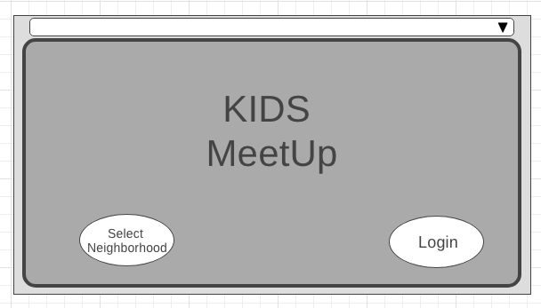
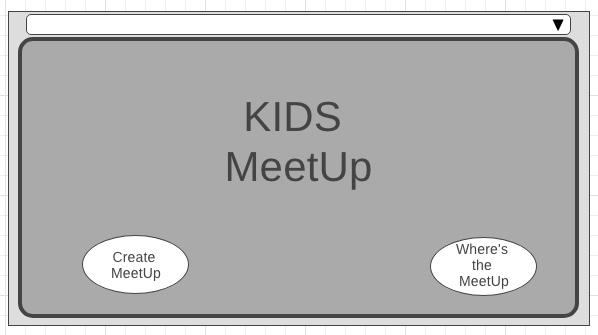
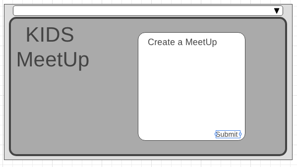
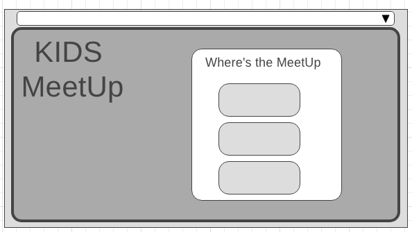
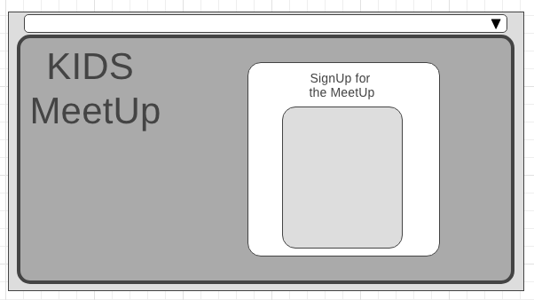

# Kids Meetup
> Social activities of our kids!! Awesome! right? But how and where? We have those answers. In out everyday busy life,our kids are getting bored and find the fun at the device. Not right ya. But in our neighbourhood, we can be feeling safer place for fun of our kids. So our Project name is KIDS MEETUP. 

## Table of contents
* [General info](#general-info)
* [Screenshots](#screenshots)
* [Technologies](#technologies)
* [Links](#links)
* [RESTful API endpoints](#RESTful_API)
* [Problems](#problems)
* [Future enhancement](#futures)
* [Setup](#setup)
* [Features](#features)
* [Status](#status)
* [Inspiration](#inspiration)
* [Contact](#contact)

## General info
In our busy life, out kidz are getting glued in the device,which is not good for our future. We just try to find the way for a safer and comfort place in our neighbourhood by this app.

## Screenshots

## Technologies
* HTML5, JavaScript ES6, CSS3, 
* Python - version 3.7.1
* Django - version 2.0
* Postgresql - version 11.0

## Links

* [pitch-deck](https://github.com/fagleyali/kidsmeetup)
* [trello](https://trello.com/b/uNiUV3Hu)
* [Heroku](https://id.heroku.com/login)

## RESTful_API

RESTful API documentation.

## Problems

## Futures

## Setup
Describe how to install / setup your local environement / add link to demo version.

## Code Examples
from django.db import models

class Parent(models.Model):
    name=models.CharField(max_length=100)
    address=models.CharField(max_length=100)

class Event(models.Model):
    name:models.CharField(max_length=2)
    address:models.CharField(max_length=100)
    parent=models.ForeignKey(Parent,on_delete=100)
    
class Child(models.Model):
    name=models.CharField(max_length=100)
    date_of_birth=models.DateField()
    parent=models.ForeignKey(Parent,on_delete=models.CASCADE)
    event=models.ForeignKey(Event,on_delete=models.CASCADE)

## Features
List of features ready and TODOs for future development
* Sign up for parents
* Get notifications of the new events
* able to choose food from the menu
* able to find the name, address and contact no of the event generator
* able to see the pics of other kids

To-do list:
* Better design to be used
* To choose Api for our project
* To make proper route, class based views functions, templates for event_list, event_detail, child_list, child_detail
* to make one to many relationship between event table and child table, parent table and child table. 
* to make a food table and create many to many relationship between food to child table.
* to authenticate users using Django's built-in authentication. 
* restricting access to creation, deletion, updating of resources.
* to use AWS S3 for image upload
* to deploy the completed project in Heroku

## Status
Project is: pre project work just started. We are preparing the set up for the project, collecting accessories, images, apis. 

## Inspiration
Add here credits. Project inspired by #GENERAL ASSEMBLY#

## Contact
Created by [@DATX team]- feel free to contact us!

